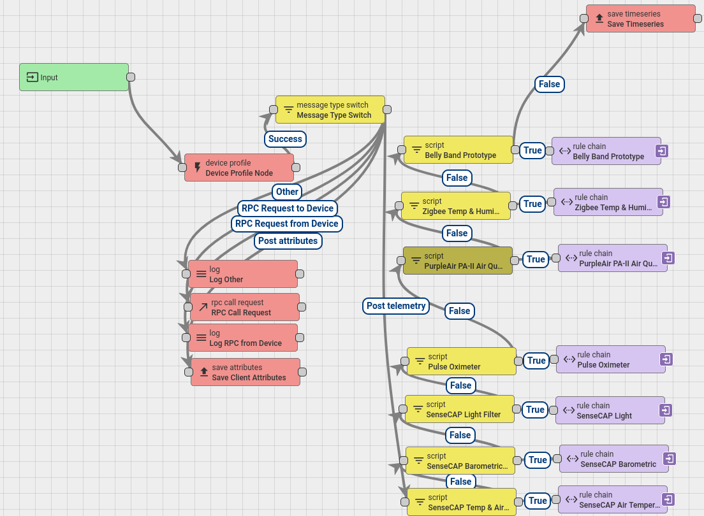

ThingsBoard Rule Chains
=======================

What are Rule Chains?
---------------------
Rule chains are how thingsboard processes incoming data. Oftentimes, sensors send data that is not in a human-readable format. Rule chains can execute functions that modify this data so that it is usable. Rule chains are very flexible and can do many things. We will only be covering a small part of the functionality of rule chains. If you think somethings might be possible with a rule chain but isn't covered here, refer to the offical ThingsBoard documentation for the `Rule Engine <https://thingsboard.io/docs/user-guide/rule-engine-2-0/re-getting-started/>`_.

Rule Chain Breakdown
--------------------
Below is an example root rule chain. In fact, it is the root rule chain for VarIoT.

You can get to the root rulechain yourself by logging into thingsboard and navigating to the Rule Chain tab, then clicking "Root Rule Chain" and "Open rule chain". The important path in the chain is the one that follows "Input -> Device Profile -> Message Type Switch -> [Post Telemetry]". Rule chains are drag-and-drop node trees where each node decides what to do and where to go next once it is executed. The "Message Type Switch" node sends the different parts of the message to different places. Here we use the "Post Telemetry" arrow to only transform packets that have telemetry in them. Each "Script that is stacked vertically checks the incoming packet against the name of a device and executes a secondary rule chain if the name matches. Otherwise, it simply passes the packet on to the next item in the chain to check the name on down the line of comparisons. Each secondary rule chain is essentially just a script that converts the packet data into human readable data and puts it back into the packet in place of the network data.

Data Transformation
-------------------
One of the simpler data transformations lives in the script node of the "Zigbee Temp & Humidity" rule chain. This script simply grabs the Celsius temperature, which the sensor transmits by default, and converts it to Fahrenheit. Once it has both temperature values it sets two new json attributes, ``msg.temp_celsius`` and ``msg.temp_farenheit``, and deletes the old ``msg.temperature`` attribute. **Important:** You must return the json object at the end of the function, or else nothing gets modified!

.. code-block:: javascript

    function celsiusToFarenheit(temp_celsius) {
        function precisionRound(number, precision) {
            var factor = Math.pow(10, precision);
            return Math.round(number * factor) / factor;
        }

        return precisionRound(temp_celsius * 9/5 + 32, 2);
    }

    if (msg.hasOwnProperty('temperature')) {
        msg.temp_celsius = msg.temperature;
        msg.temp_farenheit = celsiusToFarenheit(msg.temp_celsius);
        delete msg.temperature;
    }

    return {msg: msg, metadata: metadata, msgType: msgType};

Further Reading
---------------
The "Belly Band Prototype" and "Pulse Oximeter" rule chains are particularly interesting and useful for seeing the framework of how to transform complex data into useful data. Usually, the sensor that you're using comes with documentation that specifies the data format at the very least. In a lot of cases the sensor vendor will even provide functions for transforming the sensor's data. If not, use the data format to write functions to decode the data and use a rule chain to apply the transformations.